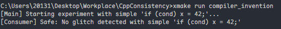

# 注意, 本文最新版本请在[本人博客中查看](http://vanishing.cc/2026/03/18/Programming/Cpp/%E4%BB%8E%E7%A1%AC%E4%BB%B6%E5%BA%95%E5%B1%82%E5%BC%80%E5%A7%8B%E7%90%86%E8%A7%A3c++%E5%86%85%E5%AD%98%E5%BA%8F/)

# 从硬件底层开始理解c++内存序

# 本文概览

> - 缓存一致性
> - 内存一致性
> - 访存一致性
> - 内存序

# Intro

> 本文所有代码, 可在这个[repo](https://github.com/Vanish0314/CppConsistenccy)查看:

- 缓存一致性: **CPU硬件**层面, 确保多个处理器**缓存**同一内存地址的数据副本时, 状态是**同步**的
- 内存一致性: **架构和语言**层面, 定义一个线程中的多次**内存访问（读/写）操作**，在**什么时间**、以**什么顺序**对**其他线程可见**
- 访存一致性: 就是内存一致性

‍

其中, 为了确保缓存一致性, 有各种协议, 详见下文

同样的, 为了确保内存一致性,  各语言都有对应的内存模型. 比如由Gemini整理的下表

|**编程语言**|**内存管理机制 (Management)**|**并发内存模型 (Concurrency Model)**|**核心内存特性 (Key Features)**|
| --| -----------------------| -------------------| -----------------------------------------------------------------------|
|**C / C++**|**手动管理**(malloc/free, RAII)|**弱一致性 / 硬件级原子操作**|极致的内存控制权；程序员需手动处理生存期，极易产生悬空指针和溢出。|
|**Rust**|**所有权系统**(Ownership/Borrow)|**内存安全并发**(Send/Sync Trait)|**无需 GC**但保证内存安全；通过编译期检查确保没有数据竞争，性能顶级。|
|**Java**|**自动 GC**(分代收集, G1/ZGC)|**JMM (Happens-Before)**|虚拟机屏蔽底层细节；强类型安全，依赖`volatile`​和`synchronized`保证可见性。|
|**C#**|**自动 GC**(分代收集, Gen 0/1/2)| **.NET 内存模型 (类似 JMM)**|兼具 Java 的安全与 C++ 的灵活性；支持**值类型 (struct)** 减少堆压力，支持`unsafe`指针。|
|**Go**|**自动 GC**(三色标记, 低延迟)|**CSP 模型 (Channel)**|提倡“通过通信共享内存”；GC 针对微秒级停顿优化，适合高并发网络服务。|
|**Haskell**|**自动 GC**(针对不可变优化)|**STM (软件事务内存)**|**默认不可变**与​**惰性求值**；内存中存储 Thunk（计算延迟），并发编程天然无锁且安全。|
|**Python**|**引用计数 + 循环 GC**|**GIL (全局解释器锁)**|开发极其简便；但 GIL 限制了多核物理并行，内存占用随对象头信息膨胀。|
|**JavaScript**|**自动 GC**(分代回收)|**单线程事件循环**|异步非阻塞架构；主线程无竞争压力，多线程依赖`SharedArrayBuffer`共享内存。|

‍

C++的内存序是C++内存模型的重要表现, 有三种逻辑模型:

- 顺序一致性模型 (Sequential Consistency)

  - ​`memory_order_seq_cst`
- 获取-释放模型 (Acquire-Release Ordering)

  - ​`memory_order_acquire`​、`memory_order_release`​、`memory_order_acq_rel`​、`memory_order_consume`
- 松散内存序模型 (Relaxed Ordering)

  - ​`memory_order_relaxed`

‍

# 缓存一致性

## 多核CPU架构


以上是一个多核CPU架构的示意图.

然而在现实中, 占据芯片85%左右面积的区域是Cache.

为什么要引入Cache? 根据 Jeff Dean的 "Latency Numbers Every Programmer Should Know"

```伪代码
Latency Comparison Numbers (~2012)
----------------------------------
L1 cache reference                           0.5 ns
Branch mispredict                            5   ns
L2 cache reference                           7   ns                      14x L1 cache
Mutex lock/unlock                           25   ns
Main memory reference                      100   ns                      20x L2 cache, 200x L1 cache
Compress 1K bytes with Zippy             3,000   ns        3 us
Send 1K bytes over 1 Gbps network       10,000   ns       10 us
Read 4K randomly from SSD*             150,000   ns      150 us          ~1GB/sec SSD
Read 1 MB sequentially from memory     250,000   ns      250 us
Round trip within same datacenter      500,000   ns      500 us
Read 1 MB sequentially from SSD*     1,000,000   ns    1,000 us    1 ms  ~1GB/sec SSD, 4X memory
Disk seek                           10,000,000   ns   10,000 us   10 ms  20x datacenter roundtrip
Read 1 MB sequentially from disk    20,000,000   ns   20,000 us   20 ms  80x memory, 20X SSD
Send packet CA->Netherlands->CA    150,000,000   ns  150,000 us  150 ms

Notes
-----
1 ns = 10^-9 seconds
1 us = 10^-6 seconds = 1,000 ns
1 ms = 10^-3 seconds = 1,000 us = 1,000,000 ns

Credit
------
By Jeff Dean:               http://research.google.com/people/jeff/
Originally by Peter Norvig: http://norvig.com/21-days.html#answers

Contributions
-------------
'Humanized' comparison:    https://gist.github.com/hellerbarde/2843375
Visual comparison chart:   http://i.imgur.com/k0t1e.png
Interactive Prezi version: https://prezi.com/pdkvgys-r0y6/latency-numbers-for-programmers-web-development/latency.txt
```

可以看到, 速度上, CPU和内存间有几个数量级的差距

因此,现代CPU 有多级缓存, 一般来说:

- 共享的L3 缓存
- 独享的L2 缓存
- 独享的L1 缓存, 又分为 **d-cache** 和 **i-cache**

然而多级缓存的存在会引入 多级存储器的基本问题:

1. **映像规则**: 当把一个块调入高一层级的存储器时, 可以放到哪些位置?
2. **查找方法**: 如何找到该块?
3. **替换策略**: 当发生失效(高层级存储器不够用)时, 应该替换哪一块?  
    当cpu访问某一个内存地址, cache miss从而要加载新的块时, 发现容量无法满足了, 就会发生替换
4. **写策略**: 当进行写操作时, 应该进行哪些操作?

### 写策略

在介绍具体策略前, 可以大致地了解一下各个存储器访问的时间片消耗

|从CPU到|大约需要的CPU周期|大约需要的时间(单位ns)|
| ----------| ---------------------| ------------------------|
|寄存器|1 cycle||
|L1 Cache|\~3-4 cycles|\~0.5-1 ns|
|L2 Cache|\~10-20 cycles|\~3-7 ns|
|L3 Cache|\~40-45 cycles|\~15 ns|
|内存|\~120-240 cycles|\~60-120ns|

#### Write Through(写直达)


每一次cpu写数据时, 都写回内存

由于写直达每一次都会写回内存, 导致消耗时间片太多了, 因此有了写回策略

#### Write Back(写回)


只把数据写回cache, 只当缓存行被替换时才更新到内存中

但是这种策略在多核处理器中就会导致缓存不一致


比如两个核心都去操作共同的变量 a, b.

由于数据没有被写回到内存中, 就会导致cpu各干各的, 导致结果可能让人意外

这就是缓存一致性问题

### 缓存一致性解决措施

核心问题是: **如何同步两个核心的缓存数据**

**一致性的内存系统: 所有处理器在任何时刻, 对每一个**​**​`数据项`​**​**的最后一个全局写入值, 有一个一致的视角**

> 值得注意的是, 这里说的是数据项, 即逻辑上的 变量 `a`​ 这样的.  
> 而非内存地址,  因为变量`a`在不同的内存地址上可能出现值不同,  需要区分

即我们不希望发生下面这种情况:


CPU1和CPU4都在写`a`​, CPU2 和 CPU3 都在读`a`

一致性的内存系统中, 2和3 读到的`a`的顺序一定是相同的 100 200或者200 100

而实现3的**关键**在于:

- **相关性**: 一个数据项的任何读写均可得到该数据最近被写的值
- **一致性**: 一个处理器何时读到另一个处理器最近更新的内容  
  即当数据不一致时,什么时候同步数据

当前主流有两种协议

#### 监听协议

- **工作机制**：所有物理核心的缓存都通过一个共享的\*\*总线（Bus）\*\*或互连网络进行通信，并时刻监控（监听）总线上的数据事务。当某个核心（如 CPU1）修改了本地缓存中的数据时，它必须向总线广播这一修改请求
- **一致性维护**：其他核心通过总线“监听”到该变量已被修改。如果它们也持有该数据的副本，则会根据协议将其缓存中的对应\*\*缓存行（Cache Line）\*\*标记为无效
- **性能特征**：由于所有核心都能看到总线上的每一笔交易，这种协议在核心数量较少时非常高效。但其代价是会引发\*\*缓存乒乓（Cache Ping-pong）\*\*效应：当多个核心频繁写入同一缓存行时，该行数据会在核心之间反复传输，导致处理器因等待同步信号而停顿（Stall），严重影响性能

#### 目录协议

- **工作机制**：在核心数量众多的现代多处理器系统中，总线广播会占用过多带宽。目录协议通过维护一个\*\*全局目录（Directory）\*\*来解决此问题，该目录记录了每个缓存行当前被哪些核心的缓存所持有及其读写状态
- **精准通知**：当一个核心需要修改某个数据项时，它不再向全网广播，而是首先查阅目录。由硬件逻辑根据目录记录，仅向真正持有该数据副本的核心发送失效指令
- **应用场景**：这种协议通过减少不必要的广播通信，极大地提高了系统的**扩展性（Scalability）** ，是解决大规模并行计算中数据一致性瓶颈的关键技术。尽管其内部逻辑比监听协议复杂，但它能更有效地管理跨核心的数据可见性

‍

# 内存一致性

## 为什么要有C++的内存模型

由于现代多核cpu以及缓存架构的引入, 为了确保Cache一致性, 各家CPU都有自己的解决方案, 从而导致软件层面(编译器)也会有对应的优化.

同时, 为了提高CPU的执行效率, 硬件上也有一些设计(见下文), 同样的, 传导到编译器也有对应的优化.

这些CPU机制与编译器优化共同造成了一个问题: **程序并不按我写的那样执行, 但它保证单线程下结果一致**

比如`clip1`中所演示:

```C++
#include <iostream>

int main() {
    int a = 1;
    int b = 2;

    int c = a + b;   // (1)
    int d = a * b;   // (2)

    std::cout << c << " " << d << std::endl;
}

/* Release 下生成的汇编代码:
Line 10: std::cout << c << " " << d << std::endl;
  mov    edx, 3    ; 直接把计算结果 3 (a+b) 放入寄存器
  lea    rcx, OFFSET FLAT:?cout@std@@3V?$basic_ostream@DU?$char_traits@D@std@@@1@A
  call   ??6...    ; 输出 3

  lea    rdx, OFFSET FLAT:??_C@_01CLKCMJKC@?5@ ; 加载空格 " "
  mov    rcx, rax
  call   ??$...    ; 输出空格

  mov    edx, 2    ; 直接把计算结果 2 (a*b) 放入寄存器
  mov    rcx, rax
  call   ??6...    ; 输出 2
*/
```

可以看到, 除了输出一致, 基本上是两个程序了.

‍

我们先看一下CPU与编译器会做哪些优化

- 编译器

  - 指令重排(Reordering)
  - 冗余与死代码删除(Remove)
  - Invention
  - 变量寄存器化/缓存化
- CPU

  - 指令流水线(Pipelining)与超标量执行(Superscalar)
  - 乱序执行(Out-of-Order Execution, OoO)
  - 寄存器重命名（Register Renaming）
  - 分支预测（Branch Prediction）
- Cache

  - Store Buffers

‍

### 编译器

#### 指令重排

编译器会根据寄存器占用情况和指令流水线效率，调整不具依赖关系的语句顺序

例如，在代码中先后写入变量 `A`​ 和 `B`​，编译器可能认为先写 `B` 更快，从而在生成的汇编代码中调换顺序

像`compiler_reorder`中的示例:

```伪代码
int A = 0, B = 0;
void foo()
{
    A = B + 1;  //(1)
    B = 1;      //(2) 
}

int main()
{
    foo();
    return 0;
}

/* Release 下生成的汇编代码:
 ?foo@@YAXXZ PROC    ; foo 函数开始
 ; Line 12: A = B + 1;
     mov    eax, DWORD PTR ?B@@3HA    ; 将 B 的值读入 eax
     inc    eax                       ; eax = eax + 1 (即 B + 1)
 
 ; Line 13: B = 1;
     mov    DWORD PTR ?B@@3HA, 1      ; 把 1 写入 B (!!! 注意这里)
     mov    DWORD PTR ?A@@3HA, eax    ; 把 eax 的值写入 A
     ret    0
 ?foo@@YAXXZ ENDP

逻辑顺序：
    * 在 C++ 源码中，先给 A 赋值，再给 B 赋值
    * 但在汇编中，编译器执行了 mov DWORD PTR ?B@@3HA, 1（给 B 赋值），然后才执行 mov DWORD PTR ?A@@3HA, eax（给 A 赋值）
 */
```

#### 冗余与死代码删除(Remove)

如果编译器通过静态分析认为某个循环内的检查是多余的（例如单线程下循环条件始终为真），它可能会直接优化掉该检查。这会导致多线程发出的修改信号（如 `done` 标志位）被循环体忽略

比如`compiler_remove`中的示例:

```C++
int flag = 0;

// 示例 1: 冗余写入删除
void redundant_store()
{
    flag = 1; // 编译器认为这个写入是“冗余”的，因为紧接着就被覆盖了
    flag = 2; // 最终生效的值
}

/* Release 下生成的汇编代码:
 ?redundant_store@@YAXXZ PROC
     mov    DWORD PTR ?flag@@3HA, 2  ; 直接把 2 写入 flag，完全跳过了写入 1 的指令
     ret    0
 ?redundant_store@@YAXXZ ENDP

编译器发现 flag = 1 之后没有任何读取操作就直接被 flag = 2 覆盖了，因此认为第一步是徒劳的，直接将其删除。
*/

// 示例 2: 死代码删除
void dead_code()
{
    int local_var = 100;
    local_var = local_var * 2; // 这个计算虽然发生了，但结果从未被使用
    // 函数结束，计算结果被直接丢弃
}

/* Release 下生成的汇编代码:
 ?dead_code@@YAXXZ PROC
 ; Line 22
     ret    0    ; 什么都没做，直接返回
 ?dead_code@@YAXXZ ENDP

local_var 是一个局部变量，它的计算结果没有通过返回值、全局变量或函数调用传递出去。编译器判定这段代码对外部世界“毫无贡献”，因此整段逻辑被移除。
*/

int main()
{
    redundant_store();
    dead_code();
    return 0;
}

/*
这种优化在单线程中是完美的，但在多线程中可能导致严重的并发问题：

    假设一个线程（生产者）正在执行 redundant_store，而另一个线程（消费者）正在轮询 flag 的值：

        1 // 消费者线程
        2 while (flag != 1) {
        3     // 等待状态 1 的出现，以执行某些中间初始化逻辑
        4 }
    * 由于编译器的 Remove 优化，flag = 1 这个中间状态在机器码层面根本不存在
    * 消费者线程将永远阻塞在 while 循环中，或者直接跳过状态 1 看到状态 2。这种“状态丢失”会导致多线程状态机的逻辑崩溃

    可以查看 src/compiler_remove_concurrency.cpp 以了解这个问题的实际演示。
*/

```

#### Invention

由于CPU的Speculative execution

可能导致如下代码优化:

```C++
// Invention示例代码
// 原始代码
if( cond ) x = 42;

// 优化后代码
r1 = x;// read what's there
x = 42;// oops: optimistic write is not conditional
if( !cond)// check if we guessed wrong
    x = r1;// oops: back-out write is not SC
```

然而在`compiler_invention`示例中可以看到输出:



没能成功复现这个现象

‍

### CPU

#### 指令流水线(Pipelining) & 超标量执行(Superscalar) & 乱序执行（Out-of-Order Execution, OoO）

在CPU中, 执行一条指令有三个阶段: 取指, 译码, 执行

在早期的CPU中, 一条指令必须等待前一条指令执行完毕才会被取指

现代CPU中,引入了Pipeline与超标量执行(一个cycle可以执行多个指令)与乱序执行, 这里可以看[The 80’s Algorithm to Avoid Race Conditions (and Why It Failed)](https://www.youtube.com/watch?v=QAzuAn3nFGo)中15:45的一个片段

<video controls="controls" src="assets/PixPin_2026-03-17_12-33-50-20260317123422-lcenbeu.mp4"></video>

### 什么是内存一致性

> 内存一致性（或访存一致性）是**架构或编程语言层面**的协议
>
> 它定义了在一个线程中进行的多次内存访问（读/写）操作，在什么时间、以什么顺序对其他线程可见

内存一致性的基础是**修改顺序.**

修改顺序, 就是程序中所有线程对一个对象的写入操作的列表

内存一致性要求:

- **一致性**: 虽然修改顺序在不同运行中可能变化，但在单次执行中，**所有线程必须对每个独立变量的修改顺序达成一致**
- **可见性约束**: 一旦某个线程看到过修改顺序中的某个值，它随后的读取操作必须返回该值或更靠后的值；随后的写入操作必须排在修改顺序的更后面

### 什么是内存模型

内存模型（Memory Model）是多线程编程的**底层契约**

规定了**编译器和硬件在处理内存访问时必须遵守的规则**，以确保内存一致性

在逻辑层面, 有以下几个概念:

- 顺序一致
- Hapens-before
- Synchronizes-with

#### 顺序一致

**硬件架构**根据其对访存指令重排的容忍程度，主要分为以下几种模型：

- **弱内存模型 (Weak Memory Model)** ：以 **DEC Alpha** 为代表。这是最宽松的模型，可能经历所有四种访存乱序（LoadLoad, LoadStore, StoreLoad, StoreStore），只要不改变单线程行为，任何 Load/Store 都能重排
- **带数据依赖序的弱模型 (Weak With Data Dependency Ordering)** ：以 **ARM、PowerPC 和 Itanium** 为代表。在弱序基础上增加了约束，能保证具有数据依赖的操作（如 C++ 中的 `A->B`）不会被乱序，加载 B 时必定已经加载了最新的 A
- **强内存模型 (Strong Memory Model)** ：以 **X86/X64** 架构为代表。它能够保证绝大多数指令的获取和释放（Acquire and Release）语义，本质上使用了 LoadLoad、LoadStore 和 StoreStore 三种内存屏障，**仅保留了 StoreLoad 的重排可能性**
- **顺序一致性 (Sequential Consistency, SC)** ：这是最强且最理想的模型，没有任何乱序存在。现代主流硬件体系结构（如 Intel 或 ARM 芯片）基本**不直接支持 SC**，因为它会严重限制 CPU 的执行效率（如寄存器、缓存和流水线的优化使用）

**语言层面**, 对底层硬件一致性模型（如 TSO、ARM 的弱序模型等）的**高级抽象**则有:

- **SC-DRF (Sequential Consistency for Data Race Free)** : 只要程序员在编写代码时通过同步手段（如锁、原子变量）消除了**数据竞争（Data Race Free）** ，编译器和硬件就必须共同保证程序的执行结果看起来就像在理想的**顺序一致性（SC）** 模型下一样
- **CSP 与消息传递 (Go, Erlang)** ：这类模型认为共享内存是复杂性的根源。**Erlang** 的 Actor 模型通过进程隔离确保了鲁棒性；**Go** 则通过通道将同步与数据传输结合，简化了并发逻辑
- **不可变模型 (Haskell)** ：由于函数不产生副效应，多个线程可以安全地同时读取任何数据，彻底消除了**修改顺序 (Modification Orders)**  带来的冲突

#### Hapens-before

按代码顺序，若语句A在语句B的前面，则语句A `Happens Before` 语句B

值得注意的是, `Hapens-before` 并不意味着 A 一定会在 B之前执行(可能被重排), 比如下面这段代码:

```C++
#include <iostream>
#include <thread>

int x = 0;
int y = 0;
int r1 = 0;
int r2 = 0;

void thread1() {
    x = 1;          // Store X
    // --- 编译器或 CPU 可能在这里插入重排 ---
    r1 = y;         // Load Y
}

void thread2() {
    y = 1;          // Store Y
    // --- 编译器或 CPU 可能在这里插入重排 ---
    r2 = x;         // Load X
}

int main() {
    int iterations = 0;
    int detected_count = 0;

    std::cout << "Starting Memory Consistency Experiment..." << std::endl;

    // 运行多次实验以捕捉“不可能”的瞬间
    while (true) {
        iterations++;
        x = 0; y = 0; r1 = 0; r2 = 0;

        // 使用两个线程同时运行
        std::thread t1(thread1);
        std::thread t2(thread2);

        t1.join();
        t2.join();

        // 检查是否发生了违反“顺序一致性”的情况
        // 理论上，如果 x=1 发生在 r2=x 之前，或者 y=1 发生在 r1=y 之前，
        // 那么 r1 和 r2 就不可能同时为 0。
        if (r1 == 0 && r2 == 0) {
            detected_count++;
            std::cout << "Iteration " << iterations 
                      << ": [CONSISTENCY VIOLATION] r1=0, r2=0 detected!" << std::endl;
            
            if (detected_count >= 5) break; // 抓到 5 次就停止
        }

        if (iterations > 1000000) {
            std::cout << "Executed 1,000,000 times, no violation detected (Luck or strong hardware)." << std::endl;
            break;
        }
    }

    return 0;
}

/// 运行结果
Starting Memory Consistency Experiment...
Iteration 144387: [CONSISTENCY VIOLATION] r1=0, r2=0 detected!
Iteration 261936: [CONSISTENCY VIOLATION] r1=0, r2=0 detected!
Iteration 265633: [CONSISTENCY VIOLATION] r1=0, r2=0 detected!
Iteration 319644: [CONSISTENCY VIOLATION] r1=0, r2=0 detected!
Iteration 415395: [CONSISTENCY VIOLATION] r1=0, r2=0 detected!
```

#### Synchronizes-with

线程间的同步, 我们可以使用原子变量等.

如果线程1对原子变量x进行写操作，线程2对原子变量x进行读操作且读到了线程1的写结果，则线程1的写操作`Synchronizes-with`线程2的读操作

比如下面这段代码:

```C++
#include <vector>
#include <atomic>
#include <iostream>

std::vector<int> data; // 非原子变量
std::atomic<bool> data_ready(false); // 原子同步变量

// 线程 1：生产者/写入者
void writer_thread() {
    data.push_back(42);           // (a) 修改非原子数据 [1]
    data_ready.store(true);       // (b) 对原子变量进行写操作 [1]
}

// 线程 2：消费者/读取者
void reader_thread() {
    while(!data_ready.load());    // (c) 对原子变量进行读操作，直到读到 true [1]
    std::cout << data << "\n"; // (d) 读取非原子数据 [1]
}
```

其中,  **(b) 同步于 (c)**

​`Synchronizes-with`​可以让我们推导出跨线程的`Happens Before`关系

上例中:

- 在线程 1 内部，根据代码顺序，`(a)`​ **Happens-before** `(b)`
- 由于` (b)`​ 与 `(c)`​ 建立了 **Synchronizes-with** 关系，因此` (b) `​**Inter-thread happens-before** `(c)`
- 在线程 2 内部，`(c)`​ **Happens-before** `(d)`
- **最终结论**：根据传递性，`(a)`​ **Happens-before** `(d)`​。这意味着当线程 2 看到 `data_ready`​ 变为 `true`​ 后，它**绝对能看到**线程 1 对 `data` 向量所做的修改（即能正确读到 42），从而避免了数据竞争和未定义行为

## 临界区（Critical Section）

多线程编程，**临界区**是一个很重要的概念

临界区是一段访问共享资源（如全局变量、数据结构或文件）的代码，为了保证程序的正确性，同一时刻只能有一个线程执行该段代码

比如下面这段代码

```C++
#include <list>
#include <mutex>
#include <algorithm>

std::list<int> some_list;    // 共享资源
std::mutex some_mutex;       // 保护资源的互斥锁

void add_to_list(int new_value) {
    // --- 临界区开始 ---
    std::lock_guard<std::mutex> guard(some_mutex); 
    some_list.push_back(new_value); 
    // --- 临界区结束 --- [6]
}

bool list_contains(int value_to_find) {
    // --- 临界区开始 ---
    std::lock_guard<std::mutex> guard(some_mutex); 
    return std::find(some_list.begin(), some_list.end(), value_to_find) != some_list.end();
    // --- 临界区结束 --- [6]
}
```

**逻辑视角：单向屏障**

从编译器和硬件优化的角度看，临界区的边界具有特殊的语义：

- **获取操作 (Lock/Acquire)** ：是一个“向下”的单向屏障。代码可以从锁外面移进临界区，但临界区内的指令不能移到锁之前
- **释放操作 (Unlock/Release)** ：是一个“向上”的单向屏障。代码可以移入临界区，但临界区内的指令不能重排到解锁之后

比如下面这段伪代码:

```C++
// --- 原始代码逻辑 ---
local_A = 100;          // (1) 外部指令：在锁之前
mutex.lock();           // --- ACQUIRE 屏障 (向下单向) ---
shared_data += 1;       // (2) 临界区内指令
mutex.unlock();         // --- RELEASE 屏障 (向上单向) ---
local_B = 200;          // (3) 外部指令：在锁之后

// --- 编译器/硬件优化后的合法执行序列 ---
mutex.lock();           // 获取锁

local_A = 100;          // 指令(1) 被“拉入”了临界区 (向下移动)
shared_data += 1;       // 指令(2) 保持在原位
local_B = 200;          // 指令(3) 被“拉入”了临界区 (向上移动)

mutex.unlock();         // 释放锁
```

简单来说, lock和unlock可以看作两个单方向的屏障，lock对应的屏障，只允许代码往下方向移动，而unlock则只允许上方向移动

c++的内存顺序借鉴lock/unlock，引入了两个等效的概念，Acquire（类似lock）和Release（类似unlock），这两个都是**单向屏障 (One-way Barriers)**

这两个单向屏障协同工作，建立了 **Synchronizes-with（同步）**  关系, 比如：

- 如果线程 A 执行了一个 **Release** 存储操作，而线程 B 执行了一个 **Acquire** 加载操作，并读到了线程 A 写入的值，那么 A 与 B 之间就建立了同步
- 由于 **Release** 保证了之前的修改不会“掉”到屏障之后，而 **Acquire** 保证了之后的读取不会“跑到”屏障之前，这种成对的关系确保了线程 A 在释放前所做的所有内存修改，在线程 B 获取后都是绝对可见的

像下面这段代码:

```C++
#include <atomic>
#include <thread>
#include <assert.h>

int x = 0;                         // 非原子变量（共享数据）
std::atomic<bool> flag(false);      // 原子变量（同步标志）

// 线程 A：执行写入与“释放”操作
void thread_A() {
    x = 42;                         // (1) 在屏障之前的内存修改
    // RELEASE 屏障：确保 (1) 不会重排到 (2) 之后
    flag.store(true, std::memory_order_release); // (2) 原子存储-释放
}

// 线程 B：执行“获取”与读取操作
void thread_B() {
    // ACQUIRE 屏障：确保 (4) 不会重排到 (3) 之前
    // 循环直到读到线程 A 写入的 true
    while (!flag.load(std::memory_order_acquire)); // (3) 原子加载-获取
    
    // 一旦 (3) 读到了 (2) 写入的值，同步关系建立
    assert(x == 42);                // (4) 在屏障之后的内存读取
}
```

- 当线程 B 的加载操作 (3) 读到了线程 A 的存储操作 (2) 写入的值时，这两个操作之间就建立了 **Synchronizes-with** 关系
- 由于**Release 屏障（向上单向）** 和 **Acquire 屏障（向下单向）** 保证的`Happens-before`​关系, 我们可以知道指令执行顺序为:  **(1) → (2) → (3) → (4)**

事实上, 这里用到的`memory_order_release`​和`memory_order_acquire`，其实是比SC-DRF更为宽松的模型(Acquire-Release 模型)

C++默认的SC-DRF对应为`memory_order_seq_cst`，使用该默认模型的操作，上移下移都不被允许，相当于双向屏障

比如:

```C++
#include <atomic>

std::atomic<bool> sync(false);
int a = 0, b = 0;

// 线程 A
void thread_A() {
    a = 1;                                 // (1) 普通写操作
    // --- SEQ_CST 双向屏障（不可逾越的墙） ---
    sync.store(true, std::memory_order_seq_cst); // (2) 原子存储
    // ------------------------------------
    b = 2;                                 // (3) 普通写操作
}
```

在这种模型下，编译器和 CPU 被施加了最严格的约束：

- **禁止向上移动**：指令 3，**不能**被重排到该原子操作之前
- **禁止向下移动**：指令 1，**不能**被重排到该原子操作之后

**结果**：对于任何观察者线程，指令的执行序列在逻辑上被锁定为  **(1)**  →  **(2)**  →  **(3)**

## C++ 的六种内存序

现代C++的内存模型，主要通过原子操作（`std::atomic`​）中的**内存序参数（**​**​`Memory Order`​**​ **)** 来约束编译器重排和CPU乱序执行，从而确保跨线程的可见性

C++将六种内存序归纳为三类强度不同的逻辑模型：

- **顺序一致模型（Sequential Consistency）** ：

  - ​`memory_order_seq_cst`。
  - 要求所有线程看到的执行顺序就像在一个全局唯一的序列中，且操作不能跨越此边界重排。它是默认且最强的模型，满足 **SC-DRF** 契约
- ​**获取-发布模型（Acquire-Release Ordering）** ：

  - ​`memory_order_consume`​, `memory_order_acquire`​, `memory_order_release`​, `memory_order_acq_rel`。
  - 建立线程间的配对同步。它通过“单向屏障”工作：**Release** 阻止指令上移（向上屏障），**Acquire** 阻止指令下移（向下屏障）
- ​**松散模型（Relaxed Ordering）** ：

  - ​`memory_order_relaxed`。
  - 仅保证操作的原子性，不提供任何跨变量的同步或可见性保证

### 六种内存序枚举值

|枚举值|核心意义与重排限制|
| --------| ----------------------------------------------------------------------------------------------------------------------------------------------------------|
|**relaxed**|**最弱保证**<br />不对其他读写操作有同步或重排限制，仅保证操作本身是原子的，且所有线程对该单一变量的修改顺序达成一致<br />|
|**consume**|**细粒度优化版 Acquire**<br />它是为了优化性能，仅针对具有**数据依赖关系（Data Dependency）** 的写操作结果可见<br />例如加载一个指针，仅保证该指针指向的内容可见，而不保证其他无关变量可见<br />|
|**acquire**|**向下单向屏障（Load操作）** <br />严禁此操作之后的指令重排到其前面<br />|
|**release**|**向上单向屏障（Store操作）** <br />严禁此操作之前的指令重排到其后面<br />|
|**acq_rel**|**双向语义（RMW操作）** <br />它在逻辑上兼具获取（Acquire）和释放（Release）的功能：后续指令不能上移，前序指令不能下移<br />它作为同步链的中间环节，既同步于前序的`release`​，又同步于后续的`acquire`<br />|
|**seq_cst**|**双向强力屏障**<br />除了具备 Acquire/Release 语义外，它还保证了**全局全序**<br />所有线程观察到的`eq_cst`操作顺序必须完全一致<br />|

其中, 不是所有枚举值都适用于所有原子操作

适配关系如下:

|操作类型|有效的 Memory Order 枚举值|逻辑归属|
| -----------| ----------------------------| -----------------|
|**Load**(如`load()`)|​`relaxed`​,`consume`​,`acquire`​,`seq_cst`|获取语义|
|**Store**(如`store()`​,`clear()`)|​`relaxed`​,`release`​,`seq_cst`|释放语义|
|**RMW**(如`fetch_xxx()`​,`exchange()`)|**全部 6 种**均可|获取 + 释放语义|

### 内存模型的使用

#### 松散模型（Relaxed Ordering）

可以查看`mo_relaxed`示例

```C++
#include <iostream>
#include <atomic>
#include <thread>

std::atomic<int> data{0};
std::atomic<bool> ready{false};
std::atomic<int> counter{0};

void producer() {
    // 1. 验证原子性：每个线程加 1000 次
    for (int i = 0; i < 1000; ++i) {
        counter.fetch_add(1, std::memory_order_relaxed);
    }

    // 2. 验证可见性顺序：
    // 在 relaxed 模式下，下面两行可能会被编译器或 CPU 重排
    data.store(42, std::memory_order_relaxed); 
    ready.store(true, std::memory_order_relaxed); 
}

void consumer() {
    // 等待标志位
    while (!ready.load(std::memory_order_relaxed));

    // 虽然 ready 已经是 true 了，但由于不保证可见性顺序，
    // 在某些硬件架构（如 ARM）或极其激进的编译器优化下，
    // 这里读到的 data 可能是 0 而不是 42。
    if (data.load(std::memory_order_relaxed) == 0) {
        std::cout << "[Relaxed] GLITCH: Saw ready=true but data=0! (Visibility Order Violation)" << std::endl;
    }
}

int main() {
    std::cout << "Starting Relaxed test..." << std::endl;

    // 运行多次实验
    for (int i = 0; i < 100; ++i) {
        data = 0;
        ready = false;
        counter = 0;

        std::thread t1(producer);
        std::thread t2(consumer);
        t1.join();
        t2.join();

        // 验证原子性
        if (counter.load() != 1000) {
            std::cout << "[Relaxed] Atomicity Error! Counter: " << counter.load() << std::endl;
        }
    }

    std::cout << "Test finished. (On x86, glitches are rare due to TSO hardware, but allowed by C++ standard)" << std::endl;
    
    return 0;
}

```

‍

#### 顺序一致模型（Sequential Consistency）

可以查看`mo_seq_cst`示例

```C++
#include <iostream>
#include <atomic>
#include <thread>

std::atomic<int> x{0};
std::atomic<int> y{0};
int r1 = 0;
int r2 = 0;

void thread1() {
    x.store(1, std::memory_order_seq_cst); // Store X
    r1 = y.load(std::memory_order_seq_cst); // Load Y
}

void thread2() {
    y.store(1, std::memory_order_seq_cst); // Store Y
    r2 = x.load(std::memory_order_seq_cst); // Load X
}

int main() {
    int iterations = 0;
    int violation_count = 0;

    std::cout << "[Seq_Cst] Starting experiment. This will run 500,000 times..." << std::endl;

    for (int i = 0; i < 500000; ++i) {
        x = 0; y = 0; r1 = 0; r2 = 0;

        std::thread t1(thread1);
        std::thread t2(thread2);
        t1.join();
        t2.join();

        // 在 seq_cst 下，r1=0 且 r2=0 是绝对不可能发生的
        if (r1 == 0 && r2 == 0) {
            violation_count++;
        }
    }

    std::cout << "[Seq_Cst] Completed 500,000 iterations." << std::endl;
    std::cout << "[Seq_Cst] Violations (r1=0, r2=0) detected: " << violation_count << std::endl;

    return 0;
}
```

#### 获取-发布模型（Acquire-Release Ordering）

可以查看`mo_acq_rel`示例

```C++
#include <iostream>
#include <atomic>
#include <thread>
#include <string>

std::atomic<bool> ready{false};
std::string data;

void producer() {
    data = "Payload delivered safely!"; // (1) 写普通数据
    // release: 严禁 (1) 被重排到 store 之后
    // 保证之前的写入对 acquire 它的线程可见
    ready.store(true, std::memory_order_release);
    std::cout << "[Producer] Flag set to ready." << std::endl;
}

void consumer() {
    // acquire: 严禁下面的 (2) 被重排到 load 之前
    while (!ready.load(std::memory_order_acquire));
    
    // (2) 读普通数据
    std::cout << "[Consumer] Data observed: " << data << std::endl;
}

int main() {
    std::thread t1(producer);
    std::thread t2(consumer);
    t1.join();
    t2.join();
    return 0;
}
```

#### `memory_order_consume`

- 是 `memory_order_acquire`​ 的一个特例，专门用于处理**数据依赖性（Data Dependency）**

- 限制同步仅发生在该原子变量指向的**直接依赖数据**上  
  如果线程 A 使用 `release`​ 发布一个指针，线程 B 使用 `consume` 加载该指针，则只有通过该指针访问的数据能保证一致性，而指针之外的无关变量不保证同步

- 主要用于**读取很少更改的指针（如 RCU(Read-Copy-Update) 模式）**   
  它可以避免在某些弱序硬件（如 ARM）上生成不必要的内存屏障指令，从而提升性能

- **对于不相关的代码（即没有数据依赖的代码），**​**​`memory_order_consume`​**​**不提供排序约束，允许上下重排**

你可以查看`mo_consume`示例:

```C++
#include <iostream>
#include <atomic>
#include <thread>
#include <string>


struct Config {
    int update_id;
    std::string name;
};

std::atomic<Config*> g_config_ptr{nullptr};
int g_unrelated_global = 0;

void producer() {
    // 准备数据
    Config* new_cfg = new Config{1, "RCU_Config_V1"};
    
    // (A) 修改一个完全不相关的变量
    g_unrelated_global = 100; 

    // (B) 使用 release 发布指针
    // release 确保 (A) 和 new_cfg 的初始化在 store 之前完成
    g_config_ptr.store(new_cfg, std::memory_order_release);
    
    std::cout << "[Producer] Config published." << std::endl;
}

void consumer() {
    Config* cfg;
    // (C) 使用 consume 加载指针
    while (!(cfg = g_config_ptr.load(std::memory_order_consume)));

    // 下面两行代码通过 cfg 指针访问成员，与 cfg 有“数据依赖”。
    // C++ 标准保证：通过 consume 同步后的指针访问其成员，一定能看到最新值。
    std::cout << "[Consumer] Dependent Data: ID=" << cfg->update_id 
              << ", Name=" << cfg->name << std::endl;

    // g_unrelated_global 与 cfg 指针没有任何数据依赖。
    // 虽然生产者先写了它，但由于这里使用的是 consume 而非 acquire，
    // 在底层语义上，并不保证这里一定能看到 100。
    // 在 ARM 架构上，这里的读取可能被重排到 (C) 之前，读到旧值 0。
    std::cout << "[Consumer] Unrelated Data (No Dependency): " << g_unrelated_global << std::endl;

    // 注意：在 x86-64 (TSO) 或 MSVC/GCC 下，consume 通常会被自动提升为 acquire，
    // 且硬件本身保证了 Load-Load 顺序，因此你很难在 X86 PC 上观察到 g_unrelated_global 为 0。
}

int main() {
    std::thread t1(producer);
    std::thread t2(consumer);
    t1.join();
    t2.join();
    return 0;
}

```

#### `memory_order_acq_rel`

- 它在逻辑上兼具获取（Acquire）和释放（Release）的双重功能

- 它将当前操作标记为既是一个同步点的“终点”（获取前序的发布效果），也是下一个同步点的“起点”（为后续获取操作发布当前修改）

- 它主要用于 **RMW 操作**。例如，在一个同步链条中，中间线程对原子变量执行 RMW 操作并使用 `acq_rel`，可以确保第一线程的修改能通过它“传递”给第三线程

你可以查看`mo_acq_rel_rmw`示例:

```C++
#include <iostream>
#include <atomic>
#include <thread>
#include <vector>

std::atomic<int> turn{0};
int shared_data = 0;

void worker(int id) {
    // 线程通过 acq_rel 操作参与接力
    // 逻辑：读 turn (获取同步)，加 1，写 turn (发布同步)
    while (turn.fetch_add(0, std::memory_order_acquire) != id);

    // 此时已经获得“同步”
    shared_data += id;
    std::cout << "[Worker " << id << "] Accessing shared_data. Current: " << shared_data << std::endl;

    // 移交接力棒给下一个 ID
    turn.store(id + 1, std::memory_order_release);
}

int main() {
    std::vector<std::thread> threads;
    for (int i = 0; i < 5; ++i) {
        threads.emplace_back(worker, i);
    }
    for (auto& t : threads) t.join();

    std::cout << "Final shared_data: " << shared_data << std::endl;
    return 0;
}

```

‍

# Reference

> [【技术杂谈】缓存一致性](https://www.bilibili.com/video/BV1iA4m137Xr/?spm_id_from=333.337.search-card.all.click&amp;vd_source=e83b8f8e3c1120e91a8d3bbe191efb81)
>
> [https://luzhixing12345.github.io/klinux/articles/arch/cpu/](https://luzhixing12345.github.io/klinux/articles/arch/cpu/)
>
> [https://luzhixing12345.github.io/klinux/articles/arch/cache/](https://luzhixing12345.github.io/klinux/articles/arch/cache/)
>
> [https://luzhixing12345.github.io/klinux/articles/arch/multicore/](https://luzhixing12345.github.io/klinux/articles/arch/multicore/)
>
> [https://luzhixing12345.github.io/klinux/articles/arch/cache-coherence/](https://luzhixing12345.github.io/klinux/articles/arch/cache-coherence/)
>
> [https://luzhixing12345.github.io/klinux/articles/arch/memory-coherence/](https://luzhixing12345.github.io/klinux/articles/arch/memory-coherence/)
>
> [https://blinkfox.com/2018/11/18/ruan-jian-gong-ju/cpu-duo-ji-huan-cun/](https://blinkfox.com/2018/11/18/ruan-jian-gong-ju/cpu-duo-ji-huan-cun/)
>
> [https://www.cnblogs.com/yanlong300/p/8986041.html](https://www.cnblogs.com/yanlong300/p/8986041.html)
>
> [https://herbsutter.com/2012/08/02/strong-and-weak-hardware-memory-models/](https://herbsutter.com/2012/08/02/strong-and-weak-hardware-memory-models/)
>
> [https://en.cppreference.com/w/cpp/atomic/memory_order.html](https://en.cppreference.com/w/cpp/atomic/memory_order.html)
>
> [https://www.ramtintjb.com/blog/memory-ordering](https://www.ramtintjb.com/blog/memory-ordering)
>
> [https://arxiv.org/pdf/1803.04432](https://arxiv.org/pdf/1803.04432)
>
> [c++内存模型](https://paul.pub/cpp-memory-model/#:~:text=seq%2Dcst%20%E6%A8%A1%E5%9E%8B%20%E5%BD%93%E4%BD%BF%E7%94%A8%E5%8E%9F%E5%AD%90%E6%93%8D%E4%BD%9C%E8%80%8C%E5%8F%88%E4%B8%8D%E6%8C%87%E5%AE%9A%20memory_order%20%E6%97%B6%E5%B0%86%E4%BD%BF%E7%94%A8%E9%BB%98%E8%AE%A4%E7%9A%84%E5%86%85%E5%AD%98%E9%A1%BA%E5%BA%8F%EF%BC%9A%20memory_order_seq_cst%20%EF%BC%8C%E5%9B%A0%E6%AD%A4%E8%B0%83%E7%94%A8%E8%BF%99%E4%BA%9B%E5%87%BD%E6%95%B0%E6%97%B6%E6%8C%87%E5%AE%9A%E6%88%96%E8%80%85%E4%B8%8D%E6%8C%87%E5%AE%9A%E8%BF%99%E4%B8%AA%E5%80%BC%E6%95%88%E6%9E%9C%E6%98%AF%E4%B8%80%E6%A0%B7%E7%9A%84%E3%80%82%20%E8%BF%99%E6%98%AF%E6%9C%80%E4%B8%A5%E6%A0%BC%E7%9A%84%E5%86%85%E5%AD%98%E6%A8%A1%E5%9E%8B%EF%BC%8Cseq%2Dcst%20%E6%9C%89%E4%B8%A4%E4%B8%AA%E4%BF%9D%E8%AF%81%EF%BC%9A%20%E7%A8%8B%E5%BA%8F%E6%8C%87%E4%BB%A4%E4%B8%8E%E6%BA%90%E7%A0%81%E9%A1%BA%E5%BA%8F%E4%B8%80%E8%87%B4%20%E6%89%80%E6%9C%89%E7%BA%BF%E7%A8%8B%E7%9A%84%E6%89%80%E6%9C%89%E6%93%8D%E4%BD%9C%E5%AD%98%E5%9C%A8%E4%B8%80%E4%B8%AA%E5%85%A8%E5%B1%80%E7%9A%84%E9%A1%BA%E5%BA%8F)
>
> [图解Modern Cpp内存序](https://www.arong-xu.com/modern-cpp/concurrency/modern-cpp-memory-order-explained/#:~:text=C++%20%E5%86%85%E5%AD%98%E5%BA%8F(Memory%20Order,%E5%AE%89%E5%85%A8%E4%B9%8B%E9%97%B4%E8%BF%9B%E8%A1%8C%E6%9D%83%E8%A1%A1.)
>
> [https://learn.arm.com/learning-paths/servers-and-cloud-computing/arm-cpp-memory-model/1/](https://learn.arm.com/learning-paths/servers-and-cloud-computing/arm-cpp-memory-model/1/)
>
> [https://wudaijun.com/2019/04/cache-coherence-and-memory-consistency/](https://wudaijun.com/2019/04/cache-coherence-and-memory-consistency/)
>
> [https://zhuanlan.zhihu.com/p/647681258](https://zhuanlan.zhihu.com/p/647681258)
>
> [https://www.cnblogs.com/Alfred-HOO/articles/19093800](https://www.cnblogs.com/Alfred-HOO/articles/19093800)
>
> [https://shili2017.github.io/posts/MCCC1/](https://shili2017.github.io/posts/MCCC1/)
>
> [https://pages.cs.wisc.edu/~markhill/papers/primer2020_2nd_edition.pdf](https://pages.cs.wisc.edu/~markhill/papers/primer2020_2nd_edition.pdf)
>
> [The 80’s Algorithm to Avoid Race Conditions (and Why It Failed)](https://www.youtube.com/watch?v=QAzuAn3nFGo)
>
> [The Weirdest Bug in Programming - Race Conditions](https://www.youtube.com/watch?v=bhpzTWtee2A)
>
> [https://www.youtube.com/watch?v=EzEKGlO9w4Y&amp;t=740s](https://www.youtube.com/watch?v=EzEKGlO9w4Y&t=740s)
>
> [https://wudaijun.com/2019/04/cache-coherence-and-memory-consistency/](https://wudaijun.com/2019/04/cache-coherence-and-memory-consistency/)
>
> [https://zhuanlan.zhihu.com/p/382372072?share_code=19rJ7MIPasNTy&amp;utm_psn=2017183491448653656](https://zhuanlan.zhihu.com/p/382372072?share_code=19rJ7MIPasNTy&utm_psn=2017183491448653656)
>
> [https://zhuanlan.zhihu.com/p/422848235](https://zhuanlan.zhihu.com/p/422848235)

‍

# 

‍
